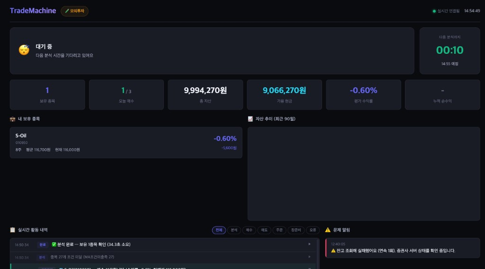

# TradeMachine



한국투자증권(KIS) Open API 기반 **국내 주식 자동매매 시스템**.

1,000만원(모의투자)으로 시작해 3주간 전략을 5번 바꾸면서 만든 **규칙 기반 단타(스캘핑) 봇**입니다. 전일대비 등락률·MA5/MA20·RSI·장 시작 후 진입 시간 등으로 매수를, 손절·익절·트레일링·데드크로스·영업일 장마감 청산(EOD) 등으로 매도를 판단합니다.

---

## 매매 일지 — 전략이 어떻게 바뀌었나

> 시작: 2026년 3월 12일 | 시작 돈: 1,000만원 (모의투자)

### 감시 종목 (28개)

아무 주식이나 사는 게 아니라, 아래 **한국 대표 대형주 28개**만 본다.

| 분류 | 종목 |
|------|------|
| 반도체/IT | 삼성전자, SK하이닉스, 삼성전기, 한미반도체 |
| 인터넷/게임 | NAVER, 카카오, 크래프톤, 엔씨소프트 |
| 자동차 | 현대차, 기아, 현대모비스 |
| 배터리/화학 | LG에너지솔루션, LG화학, 삼성SDI |
| 전자/가전 | LG전자 |
| 철강/소재 | POSCO홀딩스, 포스코퓨처엠 |
| 금융 | KB금융, 신한지주, 하나금융지주, 우리금융지주, 삼성화재 |
| 통신 | SK텔레콤, KT |
| 지주/기타 | SK, KT&G, 삼성물산, S-Oil |

왜 이 종목들만?
- 코스피 시가총액 상위권 (시총 5,000억원 이상)
- 하루 거래대금 10억원 이상, 거래량 5만주 이상 → 사고팔 때 바로바로 됨
- 주가 5,000원 이상 → 너무 싼 잡주 제외
- 관리종목, 거래정지, 투자유의 종목은 자동으로 걸러냄
- 한마디로: **이름 들으면 누구나 아는, 망할 일 없는 큰 회사들**만 봄

### 1차: "올라가는 주식 사자" 전략 (3/12 ~ 3/17)

- 28개를 5분마다 살펴봄
- 최근 5일 평균 > 최근 20일 평균이면 "오르는 중"으로 판단 → 매수
- 3일 연속 오르는 흐름 확인 후에 삼
- 결과: **6일간 딱 1번 매수(S-Oil), -43,200원 손절**
- 교훈: 올라가는 주식이 없으면 아무것도 못 한다

### 2차: "많이 떨어진 주식도 사자" 전략 추가 (3/18 ~ 3/20)

- 기존 전략에 반등 매수 추가 → 적극적으로 바뀜 (하루 매수 4번, 매도 6번)
- 삼성전기 +12,000원, 신한지주 +21,000원 등 이익도 봤지만
- **아침 장 열리면 전날 산 게 이미 떨어져 있는 문제** 발견 (밤 사이에 해외 시장 영향)

### 3차: 주말 대참사 (3/23 월요일)

- 금요일에 4종목 들고 주말 넘김
- 월요일 아침 9시: **4종목 동시 자동 손절, 하루에 -117,500원**
- SK하이닉스 혼자 -67,000원 (역대 최대 손실)
- 총 자산 982만원으로 하락
- 교훈: **금요일에 주식 들고 주말 넘기면 월요일에 폭탄**. 한국 주식시장은 토~일 안 열리니까 봇이 켜져있어도 주말엔 주문 자체가 불가능

### 4차: 당일 사고팔기 전략 (3/24 ~ 3/27)

- **오늘 사서 오늘 팔자** — 장 열려있는 동안만 보유
- **금요일 장마감 전 전량 청산** 규칙 도입
- 이익/손절 기준 ±2~3%로 타이트하게
- 3/25 SK하이닉스 +45,000원 (전체 기간 최고 이익) — 하지만 전날 밤 넘긴 게 운 좋았을 뿐
- 3/26 같은 SK하이닉스 -44,000원 — 밤 넘기면 평일에도 똑같이 당함
- 3/27 금요일 청산 규칙 첫 적용 → **주말에 빈 손으로** 성공
- 교훈: 밤을 넘기는 것 자체가 도박

### 5차: 단타 + EOD 청산 + 트레일링 (3/30 ~ 4/1)

|  | 4차 | 5차 |
|---|---|---|
| 밤 넘기기 | 가끔 다음 날까지 보유 | **매일 15:28 전량 청산** (EOD) |
| 매매 빈도 | 하루 3~4번 | 기회 있을 때만 — 억지로 안 삼 |
| **트레일링 스탑** | 없었음 | +1.5%에서 활성화, 고점 대비 -0.8%에서 자동 매도 |

**트레일링 스탑이란?** 산 후 주가가 올라가면 그 최고점을 기억해두고, 최고점에서 일정 % 떨어지면 자동 매도. 올라갈 때는 안 팔고 기다리다가, 떨어지기 시작하면 바로 빠짐.

- **3/30**: LG에너지 +8,500원 익절, 재매수 후 고점추적 -2,000원 매도 → 당일 +6,500원
- **3/31**: 엔씨소프트 +2,000원 (고점 대비 하락 자동 매도)
- **4/1**: 8종목 매수, 8종목 매도 → **+47,400원 (역대 최고의 날!)**

### 6차: KOSPI -4.21% 대폭락의 날 (4/2) 💀

- 장중에 갑자기 발표가 있었고, **KOSPI가 -4.21% 폭락** (1년에 몇 번 안 나오는 수준)
- 아침 9시 25분에 6종목 동시 매수 → **전부 떨어짐** → 7번 매도 7번 전부 손절
- **하루에 -186,200원** (역대 최악)
- 왜: 매수 횟수가 무제한이었고, 장중 급락 감지 필터가 없었음

### 7차: 현재 전략 — 급락 방어 추가 (4/2 ~)

|  | 5차 | 7차 (현재) |
|---|---|---|
| 하루 매수 | 무제한 | **최대 3건** |
| 동시 보유 | 최대 8종목 | **최대 3종목** |
| 손절 후 행동 | 바로 다른 종목 매수 | **2번 손절되면 그날 매수 중단** |
| KOSPI 하락 감지 | 20일 평균만 체크 | **오늘 -1% 이상이면 매수 차단** |
| KOSPI 급락 대응 | 없음 | **-1.5% 이상이면 전종목 긴급 매도** |

### 현재 안전장치 전체 목록

```
[매수 전]
  ① KOSPI -1% 이상 하락 중 → 매수 안 함
  ② KOSPI가 20일 평균 아래 → 매수 안 함
  ③ 하루 매수 3번까지만
  ④ 동시 보유 3종목까지만
  ⑤ 오늘 손절 2번 나오면 → 그날 매수 중단
  ⑥ 같은 종목 팔고 4시간 안에 다시 안 삼

[보유 중]
  ⑦ KOSPI -1.5% 급락 → 전종목 긴급 매도
  ⑧ 개별 종목 -2% → 자동 손절
  ⑨ 고점 대비 -0.8% → 이익 지키면서 매도
  ⑩ +2% 오르면 → 이익 확정 매도
  ⑪ 15:28 → 남아있는 거 전부 매도 (밤 넘기기 방지)
```

### 부작용과 위험 → 개선한 내용 (4/2)

**기존 부작용 3가지를 개선:**

| 기존 부작용 | 개선 내용 |
|------------|----------|
| KOSPI -1.5% 긴급매도 → V자 반등 놓침 | 긴급매도는 "연속 손절 카운터"에 안 넣음. 시장이 회복되면 다시 매수 가능 |
| 손절 2번이면 하루 종일 매수 중단 | "연속" 손절 2번으로 변경. 중간에 익절이 나오면 카운터 리셋 → 오후에 매수 재개 가능 |
| 5분 스캔 간격의 빈틈 | **3분 간격으로 축소** (API 한도 여유 확인 완료). 5분→3분으로 40% 더 빠르게 반응 |

**아직 남은 위험 (구조적 한계):**

| 위험 | 대응 |
|------|------|
| 3분 사이에 급락 가능 (실시간 아님) | 동시 보유 3종목으로 최대 피해 한정 |
| 모의투자 API 체결 지연 | 재시작하면 정상 반영. 결산 전 대기 로직 있음 |
| 장 시작 직후 변동성 | 09:25 이후에만 매수 |
| 개별 종목 악재 | -2% 손절로 대응. 3종목 제한으로 피해 한정 |

### 전체 성적표 (4/2 기준)

```
기간:        3/12 ~ 4/2 (약 3주)
시작 돈:     10,000,000원
현재:        ~9,615,000원
손익:        약 -385,000원 (-3.9%)

전략별 성적:
  1~3차 (스윙/보유):     -192,310원  ← 밤/주말 넘기면서 대부분 손해
  4차 (단타 시작):        -36,950원  ← 줄었지만 마이너스
  5차 (단타+고점추적):    +55,900원  ← 잘 됐었음!
  6차 (KOSPI 대폭락):   -186,200원  ← 하루에 다 날림

최고 이익 하루:  +47,400원 (4/1)
최악 손실 하루: -186,200원 (4/2)
```

### 배운 것들

1. **올라가는 주식이 없으면 사지 마라** — 전부 떨어지는데 억지로 사면 손해만 봄
2. **밤 사이에 떨어지는 게 제일 무섭다** — 전날 괜찮았는데 다음 날 아침에 이미 -4%
3. **금요일에는 무조건 다 팔아라** — 주말 넘기면 월요일에 폭탄 (3/23 -117,500원)
4. **같은 주식 팔았다 다시 사지 마라** — SK하이닉스 5번이나 사고팔았는데 수수료만 쌓임
5. **당일 매매가 그나마 안전** — 밤/주말 리스크 없음
6. **고점 추적이 효과 있다** — 올라갈 때 기다리고, 떨어지면 빠지니까 이익을 지킬 수 있음
7. **한꺼번에 많이 사면 한꺼번에 많이 잃는다** — 6종목 동시 매수 = 6배 리스크 (4/2 경험)
8. **시장 전체가 빠지면 뭘 사도 손해** — 개별 종목이 아니라 KOSPI를 먼저 봐야 함 (4/2 경험)
9. **좋은 날 다음에 나쁜 날이 온다** — 4/1 +47,400원 → 4/2 -186,200원. 방심 금지

---

## 기술 스택

| 항목 | 기술 |
|------|------|
| Language | Python 3.14 |
| Framework | FastAPI |
| Scheduler | APScheduler (AsyncIOScheduler) |
| HTTP Client | httpx (async) |
| Database | SQLite (aiosqlite) |
| Config | pydantic-settings (.env) |

## 프로젝트 구조

```
TradeMachine/
├── app/
│   ├── config/
│   │   ├── settings.py          # Tier 1 (.env) + Tier 2 (기본값) 설정
│   │   └── constants.py         # Tier 3: 코드 상수 (MA, 수수료, 필터)
│   ├── core/
│   │   ├── database.py          # SQLite 연결 (WAL, aiosqlite)
│   │   ├── cache.py             # 메모리 TTL 캐시
│   │   ├── rate_limiter.py      # API 호출 속도 제한
│   │   ├── event_bus.py         # SSE 이벤트 버스
│   │   ├── utils.py             # 종목명 조회 등 유틸리티
│   │   ├── exceptions.py        # 커스텀 예외
│   │   ├── logging_config.py    # 로깅 설정 (RotatingFileHandler)
│   │   └── dependencies.py      # DI 컨테이너 (lifespan 초기화)
│   ├── model/
│   │   ├── domain.py            # 도메인 모델 (Position, StockPrice, etc.)
│   │   └── dto.py               # API 요청/응답 DTO
│   ├── repository/
│   │   ├── kis_auth_repository.py      # 토큰 발급/갱신, hashkey
│   │   ├── market_data_repository.py   # 현재가, 일봉 조회
│   │   ├── order_repository.py         # 잔고, 주문, 미체결 조회
│   │   ├── order_log_repository.py     # 주문 로그 DB 관리
│   │   └── report_repository.py        # 스캔 로그, 일일 리포트
│   ├── service/
│   │   └── trading_service.py   # 핵심 매매 로직 (전략 엔진)
│   ├── router/
│   │   ├── dashboard_router.py  # 대시보드 API (포지션, 차트, SSE 등)
│   │   ├── market_router.py     # GET /market/price, /market/balance
│   │   └── trading_router.py    # POST /trading/scan, /trading/order
│   ├── scheduler/
│   │   └── trading_scheduler.py # APScheduler cron jobs
│   └── main.py                  # FastAPI 앱 팩토리
├── tests/
│   ├── unit/                    # 유닛 테스트
│   ├── integration/             # 통합 테스트
│   └── scenario/                # 시나리오 테스트
├── docs/                        # 설계 문서
├── pyproject.toml
├── main.py                      # uvicorn 엔트리포인트
└── .env.example
```

## 설치 및 실행

### 1. 가상환경 생성 및 의존성 설치

```bash
python3 -m venv .venv
source .venv/bin/activate        # macOS/Linux
# .venv\Scripts\activate         # Windows

pip install -e ".[dev]"
```

### 2. 환경변수 설정

```bash
cp .env.example .env
```

`.env` 파일을 열어 **필수 6개 값**을 입력합니다:

```env
KIS_APP_KEY=발급받은_앱키
KIS_APP_SECRET=발급받은_앱시크릿
KIS_CANO=계좌번호_앞8자리
KIS_ACNT_PRDT_CD=01
KIS_BASE_URL=https://openapivts.koreainvestment.com:29443
WATCH_LIST=005930,000660,035720
```

| 변수 | 설명 |
|------|------|
| `KIS_APP_KEY` | KIS Developers에서 발급받은 앱 키 |
| `KIS_APP_SECRET` | KIS Developers에서 발급받은 앱 시크릿 |
| `KIS_CANO` | 계좌번호 앞 8자리 |
| `KIS_ACNT_PRDT_CD` | 계좌 상품코드 (보통 `01`) |
| `KIS_BASE_URL` | 모의투자: `https://openapivts.koreainvestment.com:29443` / 실전: `https://openapi.koreainvestment.com:9443` |
| `WATCH_LIST` | 감시할 종목코드 (쉼표 구분) |

### 3. 서버 실행

```bash
python main.py
```

또는:

```bash
uvicorn app.main:app --host 0.0.0.0 --port 8001
```

서버가 실행되면:
- 대시보드: `http://localhost:8001/`
- API 문서: `http://localhost:8001/docs`
- 스케줄러가 자동으로 장 시간에 맞춰 매매를 수행합니다

### 4. 수동 API 사용

```bash
# 현재가 조회
curl http://localhost:8001/market/price/005930

# 잔고 조회
curl http://localhost:8001/market/balance

# 수동 스캔 트리거
curl -X POST http://localhost:8001/trading/scan

# 수동 주문
curl -X POST http://localhost:8001/trading/order \
  -H "Content-Type: application/json" \
  -d '{"stock_code": "005930", "order_type": "BUY", "quantity": 1}'
```

## 테스트

```bash
# 전체 테스트 실행
pytest

# 상세 출력
pytest -v

# 커버리지 포함
pytest --cov=app --cov-report=term-missing

# 특정 카테고리만
pytest tests/unit/
pytest tests/integration/
pytest tests/scenario/
```

## 자동 매매 스케줄

| 시간 | 작업 | 설명 |
|------|------|------|
| 08:50 | Pre-market | 토큰 발급, 카운터 초기화, 미체결 정리 |
| 09:00~15:27 | Scan (3분 간격) | 매도 판단 전 구간 / **신규 매수**는 `SCALPING_ENTRY_MINUTE`(기본 09:25) 이후 |
| 15:28 (월~금) | EOD close | 보유 종목 전량 청산 (야간·익일 갭 리스크 방지) |
| 15:30 | Post-market | 일일 리포트 저장, 잔고 스냅샷 |

주말 및 KRX 휴장일에는 자동으로 스킵됩니다.

## 매매 전략 요약 (단타)

상세·기본값은 [docs/trading-strategy.md](docs/trading-strategy.md) 참조.

**매수 조건** (모두 충족):
1. KOSPI > MA(20) (시장 필터, 설정으로 끌 수 있음)
2. 종목 품질 필터 (주가·거래대금·거래량·시총)
3. 장 시작 **N분 이후**(기본 09:25) — `SCALPING_ENTRY_MINUTE`
4. **전일 종가 대비** 등락률이 설정 구간 내(기본 +0.3% ~ +4%)
5. 일봉 기준 MA(5) > MA(20) 3일 유지, 현재가 ≥ MA(5)
6. RSI(14) 기본 47~65 (`RSI_SCALPING_MIN` / `MAX`)

**매도 조건** (우선순위, `.env`로 조정):
1. 손절 (-2%)
2. 익절 (+2%)
3. 트레일링 스탑 (+1.5% 활성화 후 고점 대비 -0.8%)
4. 최대 보유 영업일 초과 (2일) — EOD가 실패했을 때의 안전망
5. 데드크로스 (MA5 < MA20, 2일 유지)
6. **매 영업일 15:28** 장마감 전량 청산 (`EOD_CLOSE_ENABLED`)

**자금 배분**:
- 최대 동시 보유 3종목 (`MAX_HOLDING_COUNT=3`)
- 종목당 투자금 = 가용 현금 / 빈 슬롯 수 (약 330만원)
- 일일 매수 최대 3건 (`MAX_DAILY_BUY_COUNT=3`)
- 손절 2회 발생 시 당일 매수 자동 중단

## 설정 관리 (3계층)

| 계층 | 위치 | 역할 |
|------|------|------|
| Tier 1 | `.env` | 비밀키, 환경별 설정 (6개) |
| Tier 2 | `app/config/settings.py` | 조정 가능한 전략 파라미터 (18개) |
| Tier 3 | `app/config/constants.py` | 업계 표준, 제도 상수 (18개) |

Tier 2 파라미터는 `.env`에 추가하여 오버라이드할 수 있습니다:

```env
# 예: 손절 기준을 -3%로 변경
STOP_LOSS_RATE=-3.0

# 예: 최대 보유 종목 수 변경 (0=제한 없음)
MAX_HOLDING_COUNT=3

# 예: 일일 매수 제한 (0=무제한)
MAX_DAILY_BUY_COUNT=3
```

## 모의투자 → 실전 전환

1. 모의투자 (기본값): `KIS_BASE_URL=https://openapivts.koreainvestment.com:29443`
2. 실전 전환: `.env`에서 `KIS_BASE_URL`을 실전 URL로 변경 + `KIS_IS_PAPER_TRADING=false` 추가

```env
KIS_BASE_URL=https://openapi.koreainvestment.com:9443
KIS_IS_PAPER_TRADING=false
```

## 데이터 저장

- **SQLite** (`data/trademachine.db`): 주문 로그, 일일 리포트, 잔고 스냅샷, 스캔 로그
- **로그 파일** (`logs/`): app.log, trading.log, error.log (각 10MB, 로테이션)
